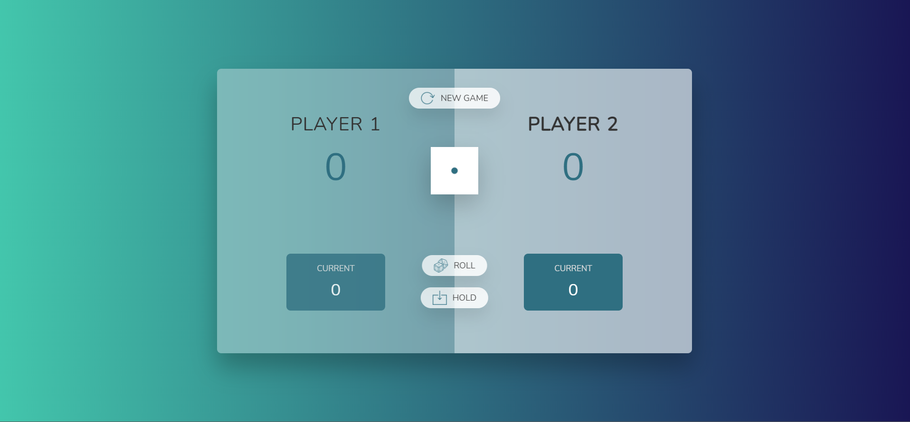

# Pig game :rocket:

This is a vanilla js game with some assets for practicing DOM and Events Fundamentals.

## Rules
**Goal:** The first player to reach 100 points win the game ! :checkered_flag:

Player 1 starts the game and has 2 options: 

1. Roll dice 
2. Hold

If the player decides to roll the dice, his current score will increment 
   by the dice value as long as the dice is not a 1.

If the player rolls a 1, it's the next player turn, and you loose all your 'current points'.

If the player click the hold button, he keeps his current accumulated score into his permanent score. The game then switch players.

Have fun :smile:

## Utilisation / Usage :computer:
1. Simply download the entire repository as a zip folder and extract to a location of your liking.
2. Open the html file, voilà !

To consult the code you can simply click on the files in question.

## Contribution / Contributing :hammer_and_wrench:

Do a pull request on the directory where I will review the changes before merge.
    
* Pull requests are welcome. For major changes, please open an 'issue' first to discuss what you want to change.

For more information on how to perform a pull request see the link [here](https://opensource.com/article/19/7/create-pull-request-github).

## License
[MIT](https://choosealicense.com/licenses/mit/)
